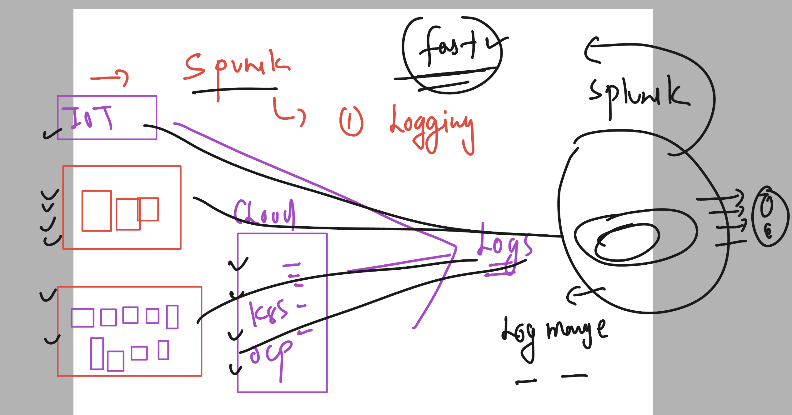
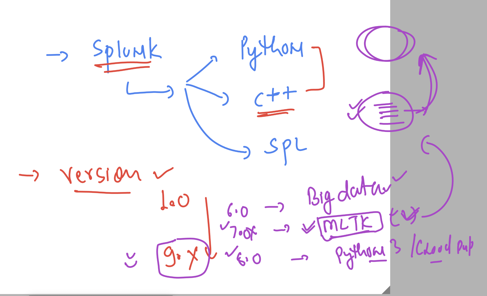
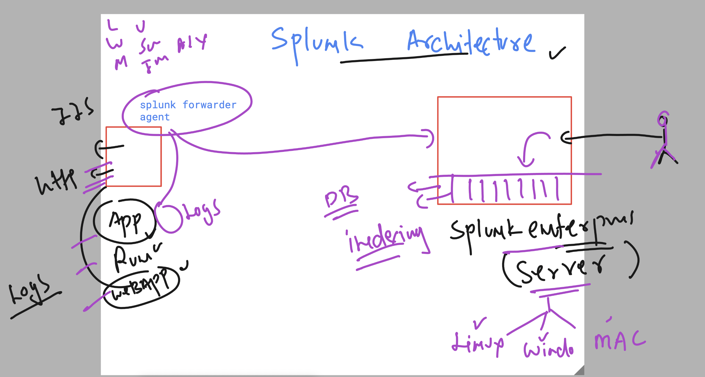
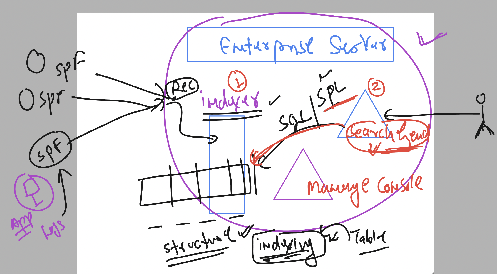
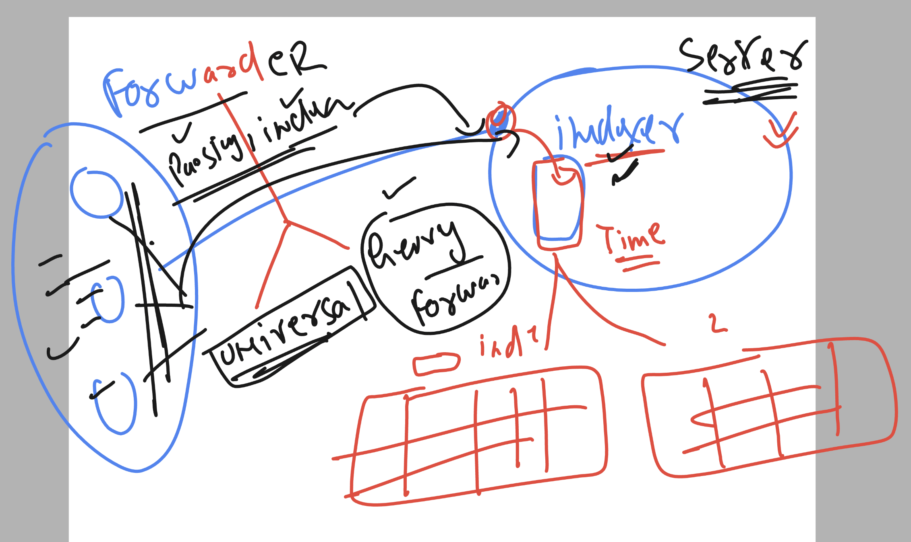
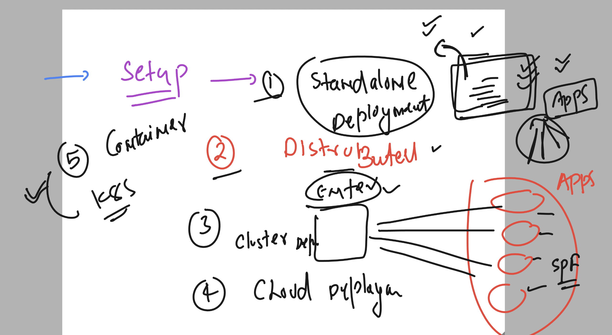
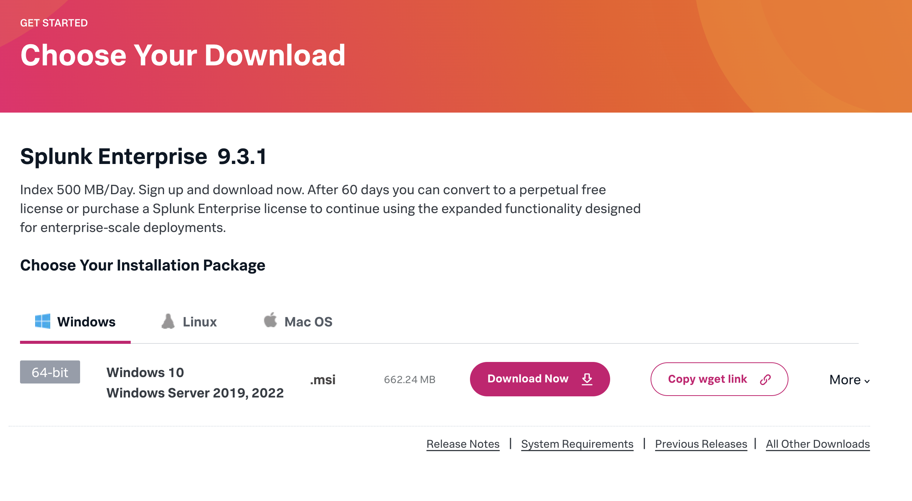
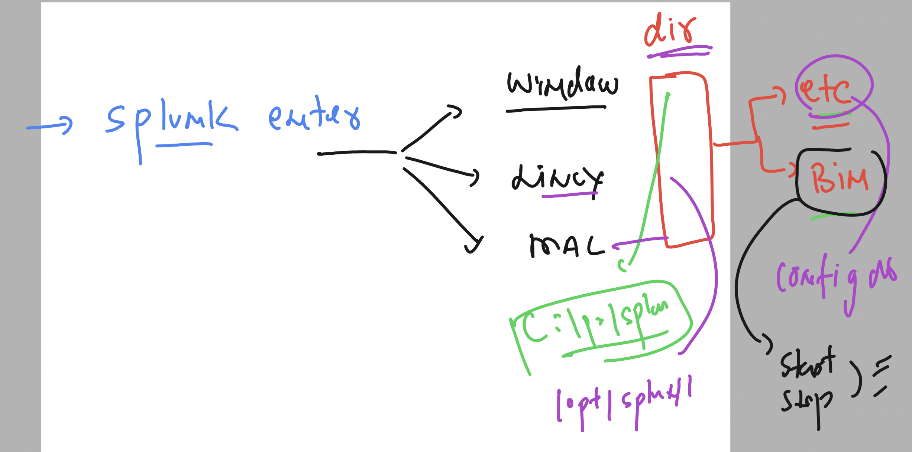
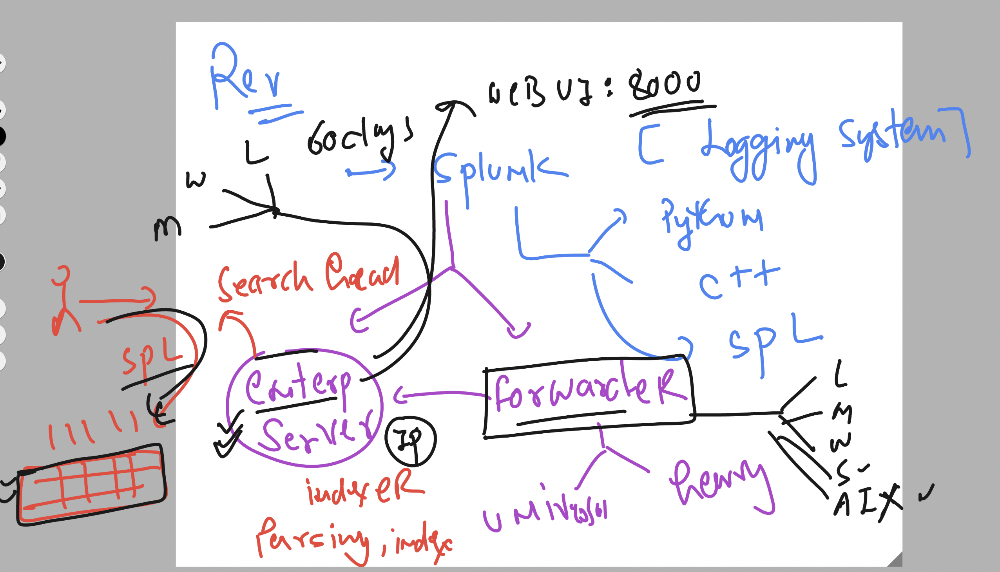
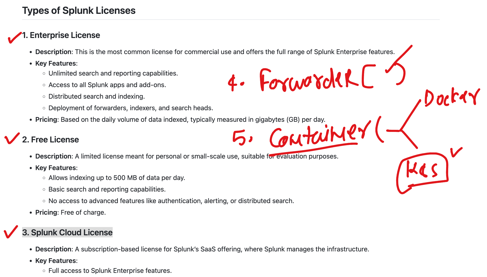

# splunkJPMC18thsept2024

### Splunk overview 



## Splunk version and other details 



### splunk architecture understanding 



### splunk enterprise server components 




### splunk forwarders 



## setup SPlunk 



## setup splunk enterprise in linux env 

### login as root user 

```

[ec2-user@ip-172-31-26-232 ~]$ sudo -i
[root@ip-172-31-26-232 ~]# 
[root@ip-172-31-26-232 ~]# whoami
root
[root@ip-172-31-26-232 ~]# 

```

### Download splunk enterprise software 




```

wget -O splunk-9.3.1-0b8d769cb912.x86_64.rpm "https://download.splunk.com/products/splunk/releases/9.3.1/linux/splunk-9.3.1-0b8d769cb912.x86_64.rpm"


--2024-09-18 06:50:59--  https://download.splunk.com/products/splunk/releases/9.3.1/linux/splunk-9.3.1-0b8d769cb912.x86_64.rpm
Resolving download.splunk.com (download.splunk.com)... 3.167.37.110, 3.167.37.124, 3.167.37.33, ...
Connecting to download.splunk.com (download.splunk.com)|3.167.37.110|:443... connected.
HTTP request sent, awaiting response... 200 OK
Length: 990009597 (944M) [binary/octet-stream]
Saving to: ‘splunk-9.3.1-0b8d769cb912.x86_64.rpm’

splunk-9.3.1-0b8d769cb912.x86_64.rpm       100%[=====================================================================================>] 944.15M  94.2MB/s    in 9.6s    

2024-09-18 06:51:09 (98.1 MB/s) - ‘splunk-9.3.1-0b8d769cb912.x86_64.rpm’ saved [990009597/990009597]


[root@ip-172-31-26-232 ~]# ls
splunk-9.3.1-0b8d769cb912.x86_64.rpm
```


### installing 

```
ls
splunk-9.3.1-0b8d769cb912.x86_64.rpm


[root@ip-172-31-26-232 ~]# rpm -ivh splunk-9.3.1-0b8d769cb912.x86_64.rpm 
warning: splunk-9.3.1-0b8d769cb912.x86_64.rpm: Header V4 RSA/SHA256 Signature, key ID b3cd4420: NOKEY
Verifying...                          ################################# [100%]
Preparing...                          ################################# [100%]
Updating / installing...
   1:splunk-9.3.1-0b8d769cb912        ###############                   ( 46%)


```

### verify installation 

```
rpm -q splunk 
splunk-9.3.1-0b8d769cb912.x86_64
```

### configuration of splunk enterprise 

```
cd /opt/splunk/


[root@ip-172-31-26-232 splunk]# ls
LICENSE.txt        bin            etc  include  license-eula.txt  opt                share                                                swidtag
README-splunk.txt  copyright.txt  ftr  lib      openssl           quarantined_files  splunk-9.3.1-0b8d769cb912-linux-2.6-x86_64-manifest
[root@ip-172-31-26-232 splunk]# 


```

### version check 

```
cat  /opt/splunk/etc/splunk.version 
VERSION=9.3.1
BUILD=0b8d769cb912
PRODUCT=splunk
PLATFORM=Linux-x86_64
[root@ip-172-31-26-232 splunk]# 
```

## splunk Installation is same for all 3 os and config dir details 



### starting splunk enterprise 

```
/opt/splunk/bin/splunk  start --accept-license 
```

### checking splunk status

```
/opt/splunk/bin/splunk  status
splunkd is running (PID: 19913).
splunk helpers are running (PIDs: 19919 20112 20117 20167 20216 20217 20242 20519).
```


### splunk start and stop 

```
/opt/splunk/bin/splunk  stop
Stopping splunkd...
Shutting down.  Please wait, as this may take a few minutes.
..                                                         [  OK  ]
Stopping splunk helpers...
                                                           [  OK  ]
Done.
[root@ip-172-31-26-232 splunk]# /opt/splunk/bin/splunk  start

Splunk> All batbelt. No tights.

Checking prerequisites...
        Checking http port [8000]: open
        Checking mgmt port [8089]: open
```


### Installation summary 
```
  2  wget -O splunk-9.3.1-0b8d769cb912.x86_64.rpm "https://download.splunk.com/products/splunk/releases/9.3.1/linux/splunk-9.3.1-0b8d769cb912.x86_64.rpm"
    3  ls
    4  history 
    5  ls
    6  exit
    7  ls
    8  rpm -ivh splunk-9.3.1-0b8d769cb912.x86_64.rpm 
    9  rpm -q splunk 
   10  cd /opt/splunk/
   11  ls
   12  cd
   13  cd /opt/splunk/
   14  ls
   15  ls  etc/
   16  cat  etc/splunk.version 
   17  cat  /opt/splunk/etc/splunk.version 
   18  ls
   19  ls bin/
   20  cd /opt/splunk/
   21  ls
   22  /opt/splunk/bin/splunk  start --accept-license 
   23  /opt/splunk/bin/splunk  status
   24  /opt/splunk/bin/splunk  stop
   25  /opt/splunk/bin/splunk  start

   ```

   ### Uninstalling 

   ```
/opt/splunk/bin/splunk  stop
rpm -e splunk  # very huge lines of output -- if not finishing then use contr + c 

rm -rf /opt/splunk/
   ```

### Splunk summary 



### splunk license 




## Splunk as container 

### Installing container platform docker 

```
yum install docker  -y 
systemctl start docker

===>
systemctl status docker
● docker.service - Docker Application Container Engine
     Loaded: loaded (/usr/lib/systemd/system/docker.service; disabled; preset: disabled)
     Active: active (running) since Wed 2024-09-18 09:04:33 UTC; 5s ago
```

