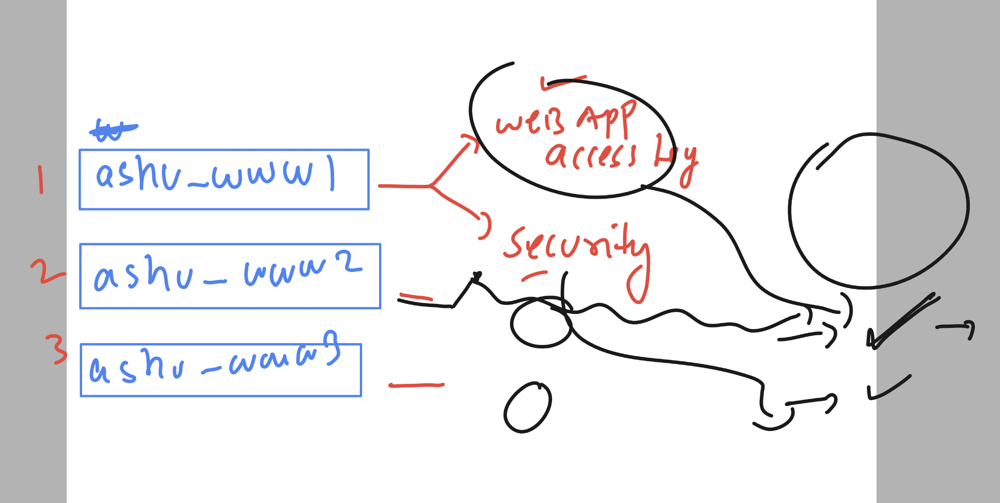
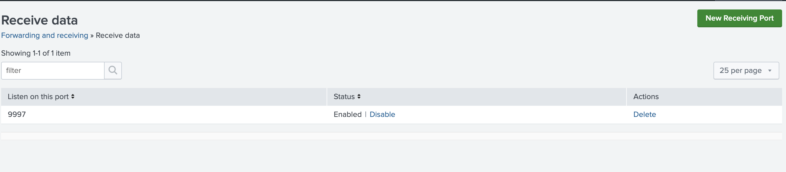

# splunkJPMC18thsept2024

### Splunk overview 


## Splunk version and other details 


### splunk architecture understanding 


### splunk enterprise server components 


### splunk forwarders 


## setup SPlunk 


## setup splunk enterprise in linux env 

### login as root user 

```

[ec2-user@ip-172-31-26-232 ~]$ sudo -i
[root@ip-172-31-26-232 ~]# 
[root@ip-172-31-26-232 ~]# whoami
root
[root@ip-172-31-26-232 ~]# 

```

### Download splunk enterprise software 


```

wget -O splunk-9.3.1-0b8d769cb912.x86_64.rpm "https://download.splunk.com/products/splunk/releases/9.3.1/linux/splunk-9.3.1-0b8d769cb912.x86_64.rpm"


--2024-09-18 06:50:59--  https://download.splunk.com/products/splunk/releases/9.3.1/linux/splunk-9.3.1-0b8d769cb912.x86_64.rpm
Resolving download.splunk.com (download.splunk.com)... 3.167.37.110, 3.167.37.124, 3.167.37.33, ...
Connecting to download.splunk.com (download.splunk.com)|3.167.37.110|:443... connected.
HTTP request sent, awaiting response... 200 OK
Length: 990009597 (944M) [binary/octet-stream]
Saving to: ‘splunk-9.3.1-0b8d769cb912.x86_64.rpm’

splunk-9.3.1-0b8d769cb912.x86_64.rpm       100%[=====================================================================================>] 944.15M  94.2MB/s    in 9.6s    

2024-09-18 06:51:09 (98.1 MB/s) - ‘splunk-9.3.1-0b8d769cb912.x86_64.rpm’ saved [990009597/990009597]


[root@ip-172-31-26-232 ~]# ls
splunk-9.3.1-0b8d769cb912.x86_64.rpm
```


### installing 

```
ls
splunk-9.3.1-0b8d769cb912.x86_64.rpm


[root@ip-172-31-26-232 ~]# rpm -ivh splunk-9.3.1-0b8d769cb912.x86_64.rpm 
warning: splunk-9.3.1-0b8d769cb912.x86_64.rpm: Header V4 RSA/SHA256 Signature, key ID b3cd4420: NOKEY
Verifying...                          ################################# [100%]
Preparing...                          ################################# [100%]
Updating / installing...
   1:splunk-9.3.1-0b8d769cb912        ###############                   ( 46%)


```

### verify installation 

```
rpm -q splunk 
splunk-9.3.1-0b8d769cb912.x86_64
```

### configuration of splunk enterprise 

```
cd /opt/splunk/


[root@ip-172-31-26-232 splunk]# ls
LICENSE.txt        bin            etc  include  license-eula.txt  opt                share                                                swidtag
README-splunk.txt  copyright.txt  ftr  lib      openssl           quarantined_files  splunk-9.3.1-0b8d769cb912-linux-2.6-x86_64-manifest
[root@ip-172-31-26-232 splunk]# 


```

### version check 

```
cat  /opt/splunk/etc/splunk.version 
VERSION=9.3.1
BUILD=0b8d769cb912
PRODUCT=splunk
PLATFORM=Linux-x86_64
[root@ip-172-31-26-232 splunk]# 
```

## splunk Installation is same for all 3 os and config dir details 


### starting splunk enterprise 

```
/opt/splunk/bin/splunk  start --accept-license 
```

### checking splunk status

```
/opt/splunk/bin/splunk  status
splunkd is running (PID: 19913).
splunk helpers are running (PIDs: 19919 20112 20117 20167 20216 20217 20242 20519).
```


### splunk start and stop 

```
/opt/splunk/bin/splunk  stop
Stopping splunkd...
Shutting down.  Please wait, as this may take a few minutes.
..                                                         [  OK  ]
Stopping splunk helpers...
                                                           [  OK  ]
Done.
[root@ip-172-31-26-232 splunk]# /opt/splunk/bin/splunk  start

Splunk> All batbelt. No tights.

Checking prerequisites...
        Checking http port [8000]: open
        Checking mgmt port [8089]: open
```


### Installation summary 
```
  2  wget -O splunk-9.3.1-0b8d769cb912.x86_64.rpm "https://download.splunk.com/products/splunk/releases/9.3.1/linux/splunk-9.3.1-0b8d769cb912.x86_64.rpm"
    3  ls
    4  history 
    5  ls
    6  exit
    7  ls
    8  rpm -ivh splunk-9.3.1-0b8d769cb912.x86_64.rpm 
    9  rpm -q splunk 
   10  cd /opt/splunk/
   11  ls
   12  cd
   13  cd /opt/splunk/
   14  ls
   15  ls  etc/
   16  cat  etc/splunk.version 
   17  cat  /opt/splunk/etc/splunk.version 
   18  ls
   19  ls bin/
   20  cd /opt/splunk/
   21  ls
   22  /opt/splunk/bin/splunk  start --accept-license 
   23  /opt/splunk/bin/splunk  status
   24  /opt/splunk/bin/splunk  stop
   25  /opt/splunk/bin/splunk  start

   ```

   ### Uninstalling 

   ```
/opt/splunk/bin/splunk  stop
rpm -e splunk  # very huge lines of output -- if not finishing then use contr + c 

rm -rf /opt/splunk/
   ```

### Splunk summary 


### splunk license 


## Splunk as container 

### Installing container platform docker 

```
yum install docker  -y 
systemctl start docker

===>
systemctl status docker
● docker.service - Docker Application Container Engine
     Loaded: loaded (/usr/lib/systemd/system/docker.service; disabled; preset: disabled)
     Active: active (running) since Wed 2024-09-18 09:04:33 UTC; 5s ago
```

### create splunk enterprise container with license 

```
docker run -d -p 8000:8000 -e "SPLUNK_START_ARGS=--accept-license" -e "SPLUNK_PASSWORD=SplunkJpmc@12345" --name splunk splunk/splunk:latest

```

### checking contaienr status

```
docker ps
CONTAINER ID   IMAGE                  COMMAND                  CREATED          STATUS                             PORTS                                                                                              NAMES
8f8df7060852   splunk/splunk:latest   "/sbin/entrypoint.sh…"   32 seconds ago   Up 29 seconds (health: starting)   8065/tcp, 8088-8089/tcp, 8191/tcp, 9887/tcp, 0.0.0.0:8000->8000/tcp, :::8000->8000/tcp, 9997/tcp   splunk
```

### splunk as contaienr 

[click_here](https://hub.docker.com/r/splunk/splunk/)


### to remove splunk container 

```
docker rm splunk -f
```

### docker with splunk 

```
47  docker run -d -p 8000:8000 -e "SPLUNK_START_ARGS=--accept-license" -e "SPLUNK_PASSWORD=SplunkJpmc@12345" --name splunk splunk/splunk:latest
   48  docker ps
   49  docker stop splunk 
   50  docker start splunk 
```

### final setup 

## Splunk enterprise as linux machine 

```
rpm -ivh splunk-9.3.1-0b8d769cb912.x86_64.rpm 
```

### env for auto start 

```

```

### SPlunk indexes and logs storage



### ways to upload data in splunk 


## setup splunk universal forwarder in linux vm 

```
wget -O splunkforwarder-9.3.1-0b8d769cb912.x86_64.rpm "https://download.splunk.com/products/universalforwarder/releases/9.3.1/linux/splunkforwarder-9.3.1-0b8d769cb912.x86_64.rpm"

===> verify 
cd /opt/splunkforwarder/
[root@ip-172-31-28-99 splunkforwarder]# ls
LICENSE.txt        bin            etc  include  license-eula.txt  share                                                         swidtag
README-splunk.txt  copyright.txt  ftr  lib      openssl           splunkforwarder-9.3.1-0b8d769cb912-linux-2.6-x86_64-manifest  uf
[root@ip-172-31-28-99 splunkforwarder]# 

```

### starting splunk forwarder 

```
/opt/splunkforwarder/bin/splunk start --accept-license 

Warning: Attempting to revert the SPLUNK_HOME ownership
Warning: Executing "chown -R splunkfwd:splunkfwd /opt/splunkforwarder"

This appears to be your first time running this version of Splunk.

Splunk software must create an administrator account during startup. Otherwise, you cannot log in.
Create credentials for the administrator account.
Characters do not appear on the screen when you type in credentials.

Please enter an administrator username: adminf
Password must contain at least:
   * 8 total printable ASCII character(s).
Please enter a new password: 
Please confirm new password: 
Creating unit file...
```

### checking status 

```

```

### enable auto start on reboot of machine 

```
/opt/splunkforwarder/bin/splunk enable boot-start
```

## note: make sure while doing enable the forwarder service must be in shutdown state

```
 16  /opt/splunkforwarder/bin/splunk stop 
   17  /opt/splunkforwarder/bin/splunk enable boot-start
   18  /opt/splunkforwarder/bin/splunk start
```


## On splunk Enterprise server configure receiver port 



### restarting splunk enterprise service 

```
/opt/splunk/bin/splunk restart 
Stopping splunkd...
Shutting down.  Please wait, as this may take a few minutes.
..                                                         [  OK  ]
Stopping splunk helpers...
                                                           [  OK  ]
Done.

Splunk> All batbelt. No tights.

Checking prerequisites...
        Checking http port [8000]: open
```

## adding splunk server details to forwarder

```
 /opt/splunkforwarder/bin/splunk   list forward-server
Warning: Attempting to revert the SPLUNK_HOME ownership
Warning: Executing "chown -R splunkfwd:splunkfwd /opt/splunkforwarder"
Splunk username: adminf
Password: 
Active forwards:
        None
Configured but inactive forwards:
        None


[root@ip-172-31-28-99 ~]# /opt/splunkforwarder/bin/splunk  add  forward-server  54.197.166.158:9997 
Warning: Attempting to revert the SPLUNK_HOME ownership
Warning: Executing "chown -R splunkfwd:splunkfwd /opt/splunkforwarder"
Added forwarding to: 54.197.166.158:9997.


[root@ip-172-31-28-99 ~]# /opt/splunkforwarder/bin/splunk   list forward-server
Warning: Attempting to revert the SPLUNK_HOME ownership
Warning: Executing "chown -R splunkfwd:splunkfwd /opt/splunkforwarder"
Active forwards:
        None
Configured but inactive forwards:
        54.197.166.158:9997
[root@ip-172-31-28-99 ~]# 
```

### lets deploy sample webapp in splunk forwarder 

```
yum install git -y
===>
git clone https://github.com/schoolofdevops/html-sample-app.git
Cloning into 'html-sample-app'...
remote: Enumerating objects: 74, done.
remote: Counting objects: 100% (3/3), done.
remote: Compressing objects: 100% (3/3), done.
remote: Total 74 (delta 0), reused 0 (delta 0), pack-reused 71 (from 1)
Receiving objects: 100% (74/74), 1.38 MiB | 35.34 MiB/s, done.
Resolving deltas: 100% (5/5), done.


[root@ip-172-31-28-99 ~]# ls
html-sample-app  splunkforwarder-9.3.1-0b8d769cb912.x86_64.rpm
```

### lets use apache apps server to deploy 

```
yum install httpd -y 

===> copy code to app server

 cp -rf html-sample-app/* /var/www/html/

 ===>
 systemctl enable --now httpd


 ====> checking logs of app

  cd /var/log/httpd/
[root@ip-172-31-28-99 httpd]# ls
access_log  error_log
[root@ip-172-31-28-99 httpd]# cat access_log 
106.219.70.181 - - [18/Sep/2024:11:53:53 +0000] "GET / HTTP/1.1" 200 8710 "-" "Mozilla/5.0 (Macintosh; Intel Mac OS X 10_15_7) AppleWebKit/537.36 (KHTML, like Gecko) Chrome/128.0.0.0 Safari/537.36"
106.219.70.181 - - [18/Sep/2024:11:53:53 +00
```