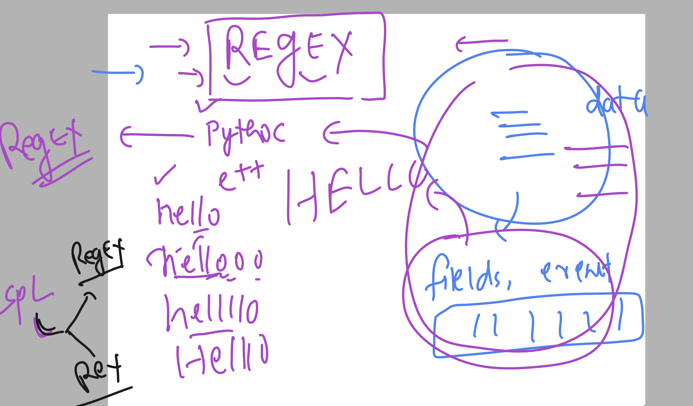
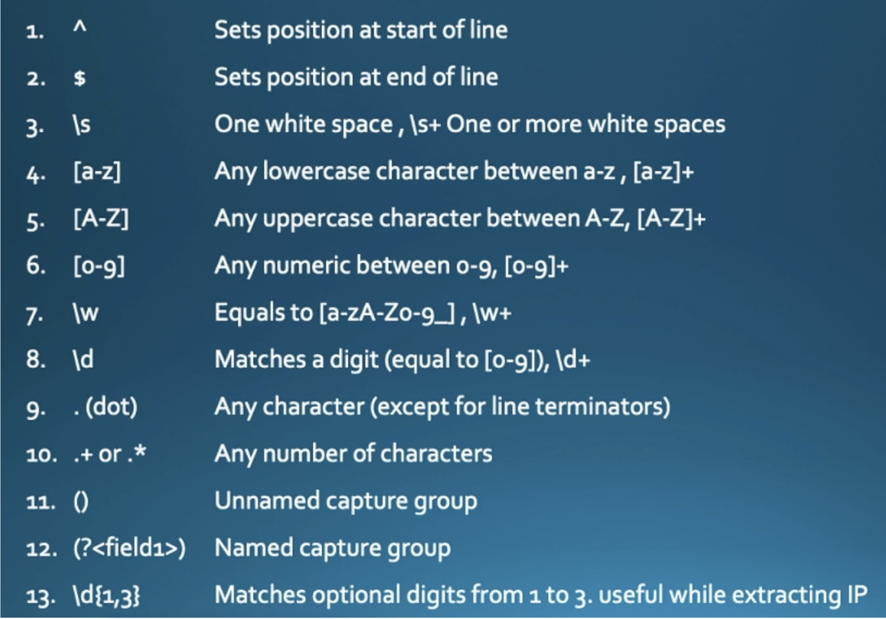
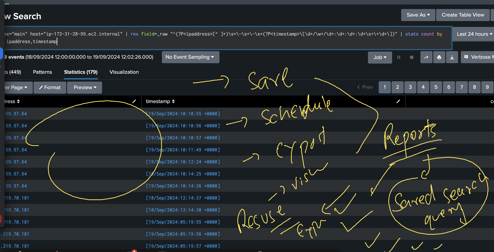

# splunkJPMC18thsept2024

## Revision 


### splunk arch 


## verify splunk forwarder status 

```
ec2-user@ip-172-31-28-99 ~]$ sudo -i

[root@ip-172-31-28-99 ~]# /opt/splunkforwarder/bin/splunk status
Warning: Attempting to revert the SPLUNK_HOME ownership
Warning: Executing "chown -R splunkfwd:splunkfwd /opt/splunkforwarder"
splunkd is running (PID: 2432).
splunk helpers are running (PIDs: 2502).
[root@ip-172-31-28-99 ~]# 

```

### webapp logs on server 

```
 cd /var/log/httpd/
[root@ip-172-31-28-99 httpd]# ls
access_log  error_log
[root@ip-172-31-28-99 httpd]# 

```

### checking my forwarder to pointing to splunk server

```
/opt/splunkforwarder/bin/splunk list forward-server
Warning: Attempting to revert the SPLUNK_HOME ownership
Warning: Executing "chown -R splunkfwd:splunkfwd /opt/splunkforwarder"
Your session is invalid.  Please login.
Splunk username: adminf
Password: 
Active forwards:
        54.197.166.158:9997
Configured but inactive forwards:
        None
```

### adding monitor to splunk forwarder so that it can send logs to server 

```
/opt/splunkforwarder/bin/splunk add monitor  /var/log/httpd/ 
```

### list monitor

```
/opt/splunkforwarder/bin/splunk list  monitor  
Warning: Attempting to revert the SPLUNK_HOME ownership
Warning: Executing "chown -R splunkfwd:splunkfwd /opt/splunkforwarder"
Monitored Directories:
        $SPLUNK_HOME/var/log/splunk
                /opt/splunkforwarder/var/log/splunk/audit.log
```

# SPL 

## example 1 

```
index="main" ( host="ip-172-31-16-190.ec2.internal" OR host="ip-172-31-17-131.ec2.internal" )
```

### Example 2 

```
index="main" ( host="ip-172-31-16-190.ec2.internal" OR host="ip-172-31-17-131.ec2.internal" ) Chrome*
```

### Example 3 

```
( index="ashu_security" OR index="ashu_web" ) host="ashu_www1" process="sshd"
```

### Example 4 

```
( index="ashu_security" OR index="ashu_web" ) | fields host , status , bytes
```

### Example 5 

```
index="main" | stats count by host
```

### example 6 -- decending order 

```
index="main" | stats count by host | sort  -  count
```

### example 7 ascending order 

```
index="main" | stats count by host | sort   count
```

### printing uniq host count and their values 

```
index="ashu_security"  process="sshd" | stats values(host) dc(host)
```

### using top and rare 

```
(index="ashu_security" OR index="ashu_web" ) | top limit=10 process
```

### using where 

```
index="main" |  top host  | where count >=104
```

### using status

```
index="main" status>=200  status<400  | stats count by host status | sort - count
```

## using EVAL 

### demo1 

```
index="ashu_web" | eval ashu_url=mvindex(split(uri,"?"),0) | table ashu_url , uri
```

### demo 2

```
index="main" | eval ashu_new_page=mvindex(split(uri,"/"),1) | table ashu_new_page , uri  | where uri>""
```

### demo 3 

```
index="main" host="ip-172-31-28-99.ec2.internal" | eval  suspicious_client=if(match(useragent, "(curl|Wget|bot)"),"Suspicious", "Legitimate") | table useragent,suspicious_client

```

# Regex in SPLunk 



## Tokens / keywords / macros in REgex 




## demo 

```
index="main" host="ip-172-31-28-99.ec2.internal" | rex field=_raw "^(?P<ashu_client_ips>[^ ]+)" | table ashu_client_ips
```

### demo 2 

```
index="main" host="ip-172-31-28-99.ec2.internal" | rex field=_raw "^(?P<ipaddress>[^ ]+)\s+\-\s+\-\s+(?P<timestamp>\[\d+/\w+/\d+:\d+:\d+:\d+\s+\+\d+\])" | stats count by   ipaddress,timestamp
```
## reports in splunk 



## answer 

```
index="main" host="ip-172-31-28-99.ec2.internal" | rex field=_raw "^(?P<ipaddress>[^ ]+)\s+\-\s+\-\s+(?P<timestamp>\[\d+/\w+/\d+:\d+:\d+:\d+\s+\+\d+\])" | stats         earliest(timestamp) as first_timestamp by ipaddress | table ipaddress ,first_timestamp
```

