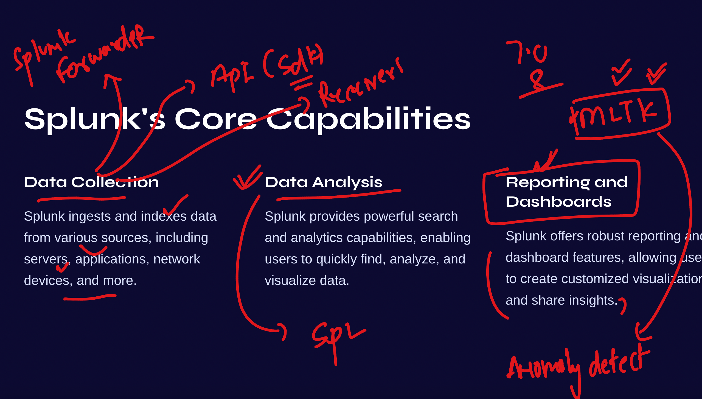

# splunkJPMC18thsept2024

## Revision 



### splunk arch 


## verify splunk forwarder status 

```
ec2-user@ip-172-31-28-99 ~]$ sudo -i

[root@ip-172-31-28-99 ~]# /opt/splunkforwarder/bin/splunk status
Warning: Attempting to revert the SPLUNK_HOME ownership
Warning: Executing "chown -R splunkfwd:splunkfwd /opt/splunkforwarder"
splunkd is running (PID: 2432).
splunk helpers are running (PIDs: 2502).
[root@ip-172-31-28-99 ~]# 

```

### webapp logs on server 

```
 cd /var/log/httpd/
[root@ip-172-31-28-99 httpd]# ls
access_log  error_log
[root@ip-172-31-28-99 httpd]# 

```

### checking my forwarder to pointing to splunk server

```
/opt/splunkforwarder/bin/splunk list forward-server
Warning: Attempting to revert the SPLUNK_HOME ownership
Warning: Executing "chown -R splunkfwd:splunkfwd /opt/splunkforwarder"
Your session is invalid.  Please login.
Splunk username: adminf
Password: 
Active forwards:
        54.197.166.158:9997
Configured but inactive forwards:
        None
```

### adding monitor to splunk forwarder so that it can send logs to server 

```
/opt/splunkforwarder/bin/splunk add monitor  /var/log/httpd/ 
```

### list monitor

```
/opt/splunkforwarder/bin/splunk list  monitor  
Warning: Attempting to revert the SPLUNK_HOME ownership
Warning: Executing "chown -R splunkfwd:splunkfwd /opt/splunkforwarder"
Monitored Directories:
        $SPLUNK_HOME/var/log/splunk
                /opt/splunkforwarder/var/log/splunk/audit.log
```


