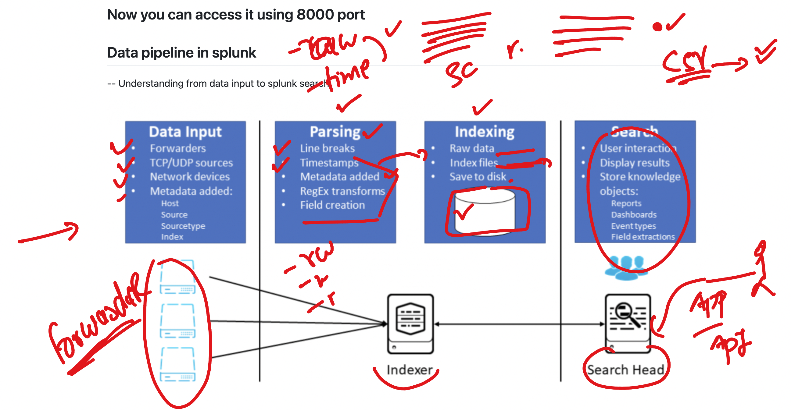

## Revision 

### Splunk CLuster with HA 


### Indexer and Search head more info 



### Indexing and Parsing queue 


## checking status

```
/opt/splunkforwarder/bin/splunk status

====>
/opt/splunkforwarder/bin/splunk list  monitor
```

## users in Splunk 


## macros in Splunk 


### we can use macros using ``

```
index="main" host="ip-172-31-16-190.ec2.internal" | `web_timestamp_clientIP`
```

## creating dashboard 


## alerts in Splunk 


### root login failed attempt ips 

```
index="ashu_security" sourcetype=linux_secure root Fail* | rex field=_raw "^\w+\s+\w+\s+\d+\s+\d+\s+\d+:\d+:\d+\s+\w+\d+\s+\w+\[\d+\]:\s+\w+\s+\w+\s+\w+\s+\w+\s+\w+\s+(?P<hacker_ip>[^ ]+)" | table _time , hacker_ip
```

## storage in splunk 


### Index and buckets 


### adding more monitoring 


## SPlunk GPT 


### searching using curl in splunk server

```
 81  curl       https://localhost:8089/services/search/jobs -d search="search index=ashu_web"
   82  curl    -k   https://localhost:8089/services/search/jobs -d search="search index=ashu_web"
   83  curl -u 'admin:SplunkJpmc@12345'   -k   https://localhost:8089/services/search/jobs -d search="search index=ashu_web"
   84  curl -u 'admin:SplunkJpmc@12345'   -k   "https://localhost:8089/services/search/jobs/726833481.32047/results?output=json" 
   85  curl -u 'admin:SplunkJpmc@12345'   -k   "https://localhost:8089/services/search/jobs/1726833481.32047/results?output=json" 
   86  history 
```

## splunk in k8s 

### deployment file 
```
ashutoshh [ ~ ]$ cat deploy.yaml 
apiVersion: apps/v1
kind: Deployment
metadata:
  creationTimestamp: null
  labels:
    app: ashu-splunk-server
  name: ashu-splunk-server
spec:
  replicas: 1
  selector:
    matchLabels:
      app: ashu-splunk-server
  strategy: {}
  template:
    metadata:
      creationTimestamp: null
      labels:
        app: ashu-splunk-server
    spec:
      containers:
      - image: splunk/splunk:latest
        name: splunk
        ports:
        - containerPort: 8000
        - containerPort: 9997
        - containerPort: 8089
        env:
        - name: SPLUNK_START_ARGS
          value: --accept-license
        - name: SPLUNK_PASSWORD
          value: SplunkJpmc@123456
        resources: {}
```


### creating service 

```
 kubectl  get deploy 
NAME                 READY   UP-TO-DATE   AVAILABLE   AGE
ashu-splunk-server   1/1     1            1           54s
ashutoshh [ ~ ]$ kubectl   expose deploy ashu-splunk-server --type LoadBalancer --port 80 --target-port 8000 
service/ashu-splunk-server exposed
ashutoshh [ ~ ]$ kubectl  get svc
NAME                 TYPE           CLUSTER-IP     EXTERNAL-IP   PORT(S)        AGE
ashu-splunk-server   LoadBalancer   10.0.170.121   <pending>     80:30273/TCP   4s
kubernetes           ClusterIP      10.0.0.1       <none>        443/TCP        8h
ashutoshh [ ~ ]$ 


```